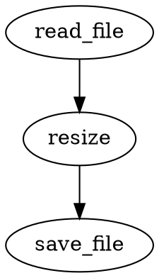

# Grammar

## Key Concepts and Syntax

This document describes the core grammar of the Conduit DSL: how to define nodes (modules), inputs, outputs, and
control structures. Examples use the `conduit` fenced code block for DSL snippets and `rust` for Rust node definitions.

---

## Nodes

A node (also called a module) has the form:

`identifier module { ... }`

The body of a node follows this structure:

```conduit
name module {
  property <- value
}
```

The `name` is optional. If a node has no name it is anonymous and cannot be referenced elsewhere.

```conduit
module {
  property <- value
}
```

Nodes can define properties that are inputs. Inputs can be provided directly or piped from other nodes.

Example Rust node that declares an input using the `#[input]` attribute:

```rust
#[node]
async fn read_file(#[input] path: String) -> Result<Vec<u8>, NodeError> {
    tokio::fs::read(path).await.map_err(NodeError::from)
}
```

This node can be used in the DSL in two equivalent ways:

```conduit
file_a read_file {
  path <- "example.txt"
}

file_b read_file {
  <- "example.txt"
}
```

Both examples are valid. If the default input name is omitted, the value can be assigned directly with `<-`.

```conduit
<- read_file <- "example.txt"
```

The string literal `"example.txt"` is assigned to the default input of the `read_file` node, and the node's output
is returned as the pipeline output.

The output of a node can also be assigned to another node inside a node body:

```conduit
read_file {
  <- "example.txt"
  -> logger
}
```

In this example, the output of `read_file` is piped into the `logger` node. This enables chaining and composition.

A more complex chain:

```conduit
resize {
  <- read_file <- "example.png"
  width <- 512
  height <- 512
  -> save_file <- "resized.png"
}
```

This pipeline reads `example.png`, resizes it to 512×512, and then passes the result to `save_file`, which writes
`resized.png`. Nodes form a directed acyclic graph (DAG) and can be visualized with graph tools.

Example using a Rust macro to generate a Graphviz representation:

```rust
graphviz!(r#"
  resize {
    <- read_file <- "example.png"
    width <- 512
    height <- 512
    -> save_file <- "resized.png"
  }
"#);
```

Generated DOT example:



---

## Inputs (Workflow Parameters)

Workflow-level inputs are declared with `->` and are usually placed at the top of the file. They indicate values
that the workflow expects from the environment.

Short form:

```conduit
-> x, y, z
```

Long form:

```conduit
-> x
-> y
-> z
```

Mixed form:

```conduit
-> x, y
-> z, w
```

Default values can be provided:

```conduit
-> x <- 1
-> y <- 2
-> z <- 3
```

If the inline form is used, the default is assigned to all listed inputs:

```conduit
-> x, y, z <- "example"
```

In this case, `x`, `y`, and `z` all receive the default value `"example"`.

If an input has no default and is not provided externally, the workflow will produce an error.

Inputs can also receive default values from other nodes:

```conduit
-> x <- random { between 0..100 }
-> y <- random { between 0..100 }
```

Note: `random` is only an example. There are no built-in nodes in the language—nodes must be defined by the user
or imported from external modules.

---

## Pipeline Outputs

Pipeline outputs are declared at the top level with `<-`.

Example (echo inputs):

```conduit
-> x, y
<- x, y
```

The output can be an expression or a node reference:

```conduit
<- (x + y) * 2
<- some_node::output
```

Multiple outputs and tuple outputs are supported:

```conduit
<- x, (y * 2), some_node::output
<- (1, (2, 3))
```

---

## Control Flow: For Loops

For loops allow repeating a block of code. The loop variable is available inside the loop body and can be used in
expressions or node parameters.

Range example:

```conduit
for index in 0..5 {
  // iterate index = 0..4
}
```

Array iteration:

```conduit
for number in [1 2 3] {
  // iterate number = 1, 2, 3
}
```

Iterating over node properties or workflow inputs:

```conduit
-> items <- [1 2 3]

for item in node::items {
  // use item
}

for item in items {
  // use item
}
```

Ranges can be exclusive or inclusive:

```conduit
for index in 0..10 { /* exclusive: 0..9 */ }
for index in 0..=10 { /* inclusive: 0..10 */ }
```
