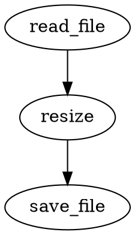

# Grammar

## Key Grammar Rules

- Node: `identifier module { ... }`

the body of a node follow this structure:

```conduit
name module {
  property <- value
}
```

the `name` is optional, if not provided the node will be anonymous and cannot be referenced by other nodes.

```conduit
module {
  property <- value
}
```

modules can define properties that are considered `input` which can be easily piped from other nodes for example:

the following rust module has the path marked with the `#[input]` macro

```rust
#[node]
async fn read_file(#[input] path: String) -> Result<Vec<u8>, NodeError> {
    tokio::fs::read(path).await.map_err(NodeError::from)
}
```

then it can be used like this:

```conduit
file_a read_file {
  path <- "example.txt"
}

file_b read_file {
  <- "example.txt"
}
```

both examples are valid, the name of defaults inputs can be ommited and simply assigned with <- this allows some
interesting possibilities for example:

```conduit
<- read_file <- "example.txt"
```

In this example the literal string "example.txt" is assigned to the default input of the `read_file` node and the output
of the node is immediately returned as the output of the pipeline.

the output of a node can also be assigned within the node body:

```conduit
read_file {
  <- "example.txt"
  -> logger
}
```

in this example the output of the `read_file` node is assigned to the input of a `logger` node, this allows for more
complex operations and chaining of nodes.

a complex chaining operation could be defined as the following:

```conduit
resize {
  <- read_file <- "example.png"
  width <- 512
  height <- 512
  -> save_file <- "resized.png"
}
```

this example it takes the output of the `read_file` node, pass it to the input of resize node, which resizes the input
and pipe the output to the `save_file` node which saves the resized image as `resized.png`, 
all nodes creates a DAG that can be visualized by passing the pipeline to a graph visualization tool.

```rust
graphviz!(r#"
  resize {
    <- read_file <- "example.png"
    width <- 512
    height <- 512
    -> save_file <- "resized.png"
  }
"#);
```


----
- Input definition: `-> x, y`, it is ussuly defined at the top of the file and indicates that the workflow will receive
  a X, Y value externally

it can be defined in two forms, short form:

```conduit
-> x, y, z
```

or long form:

```conduit
-> x
-> y
-> z
```

or mixed

```conduit
-> x, y
-> z, w
```

default values can be provided as the following:

```conduit
-> x <- 1
-> y <- 2
-> z <- 3
```

if the inlined form is used the default is assigned to all values, example:

```conduit
-> x, y, z <- "example"
```

in this example `x`, `y` and `z` will be assigned with a default value of `example`

if the inputs has no default and are not provided externally, an error will be thrown.

inputs can also have default values assigned from output of other nodes, example:

```conduit
-> x <- random { between 0..100 }
-> y <- random { between 0..100 }
```

> Note the random node defined above is just an example, there are no built-in nodes in the language, all nodes must be
> defined by the user or imported from external modules.
-----
- Pipeline result: `<- value`

Outputs are defined using the `<-` at the root level of the file,

example:

```conduit
-> x, y
<- x, y
```

This example it takes the input and imediately outputs it.

the output can also be an expression or a node reference:

```conduit
<- (x + y) * 2
<- some_node::output
```

multiple outputs can be defined in the same statement:

```conduit
<- x, (y * 2), some_node::output
```

tuples can also be returned as outputs:

```conduit
<- (1, (2, 3))
```
----
- For loop: `for index in 0..10 { ... }`

for loops can be used to repeat a block of code a certain number of times, the index variable is available inside the
loop body and can be used in expressions or node parameters.

```conduit
for index in 0..5 {

}
```

arrays can also be iterated over:

```conduit
for number in [1 2 3] {

}
```

inputs or properties of other nodes can also be iterated over:

```conduit
-> items <- [1 2 3]

for item in node::items {}
for item in items {}
```

ranges can be inclusive or exclusive:

```conduit
for index in 0..10 { ... } # exclusive, iterates from 0 to 9
for index in 0..=10 { ... } # inclusive, iterates from 0 to 10
```
